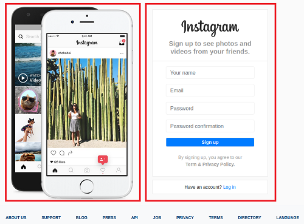
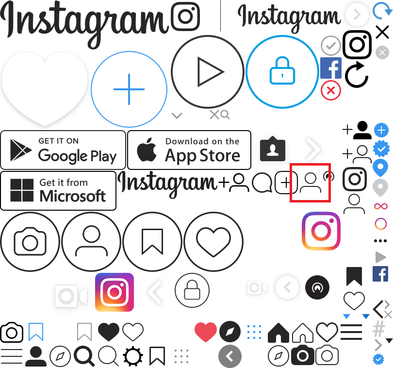
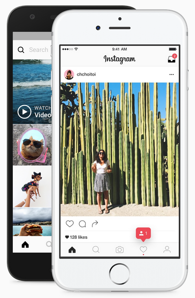
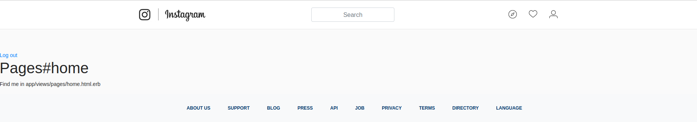

# Quicknotes AB-02 und AB-03

## Beschreibung der Technologien

### Bootstrap
Bootstrap ist CSS-Framework, welches frei genutzt werden kann. Mit Bootstrap kann man in sehr kurzer Zeit ein ziemlich gutes Design für seine Website erstellen.

**Installation**  
Da wir in unsere Applikation Yarn verwenden, kann Bootrstrap mit folgendem Befehl installiert werden.
```
yarn add bootstrap jquery popper.js
```
Nachdem Bootstrap installiert wurde, muss es noch konfiguriert werden. Dies macht man in der Datei [config/webpack/environment.js](../config/webpack/environment.js). Folgender Code muss dort eingefügt werden.
```js
const { environment } = require('@rails/webpacker')

const webpack = require('webpack')
environment.plugins.append('Provide',
  new webpack.ProvidePlugin({
    $: 'jquery',
    jQuery: 'jquery',
    Popper: ['popper.js', 'default']
  })
)

module.exports = environment
```
Im nächsten Schritt muss in der Datei [app/javascript/packs/application.js](../app/javascript/packs/application.js) Bootstrap importiert werden.
```js
import "bootstrap";
```
Dann muss die Datei `app/assets/stylesheets/application.css` zu `app/assets/stylesheets/application.scss` umbenennt werden. In dieser Datei muss Bootstrap ebenfalls importiert werden.
```scss
@import "bootstrap/scss/bootstrap";
```

**Grid**  
Mit Grid kann man die Oberflächen seiner Website einfach und gut strukturieren. Grid bietet ein 12-Spaltenlayout, welches beliebig eingesetzt werden kann.
In der Instagram Applikation wird das Grid von Bootstrap für die [Registrierungs-](../app/views/devise/registrations/new.html.erb) und [Loginseite](../app/views/devise/sessions/new.html.erb) genutzt. Erklärt wird es am Beispiel der [Registrierungsseite](../app/views/devise/registrations/new.html.erb)  
Für diese Seite werden zwei Spalten verwendet. Die Spalten sind im Bild mit rot eingezeichnet. In der linken Spalte wird das Bilder Carousel angezeigt und in der rechten Spalte das Registrierungsformular. Das Bilder Carousel wird weiter unten beschrieben. Klicker sie [hier](#dummy-phone), um mehr zu erfahren.  
  
Als erstes wird ein `div` Element mit der Klasse `row` benötigt. Diese Klasse legt fest, dass alle darin enthaltenen Elemente in einer Reihe nebeneinander dargestellt werden. Innerhalb dieses ELements folgen zwei `div` Elemente, welche als Container für die zwei Spalten dienen. Diese Elemente erhalten die Klasse `col-lg-6` welche dafür sorgt, dass die Elemente jeweils die Hälfte der Breite ausfüllen. Denn wie oben bereits erwähnt bietet das Grid von Bootstrap 12 Spalten und 6 ist folglicherweise die Hälfte von 12. Mit der Klasse `col-lg-1` würde ein Element nur einen Zwölftel der Breite einnehmen.
```html
<div class="row">
  <div class="col-lg-6">
    <!-- Bilder Carousel -->
  </div>
  <div class="col-lg-6">
    <!-- Registrierungsseite -->
  </div>
</div>
```

**Navbar**  
Mit der Navbar von Bootstrap kann man sehr einfach eine Navigationsleiste erstellen, welche sich gegenüber der Grösse des Browserfensters anpasst. Für die Instagram Applikation wurde die Navbar von Bootstrap für die Navigationsleiste verwendet. Die Navigationsleiste wurde als Partial View [app/views/shared/_navbar.html.erb](../app/views/shared/_navbar.html.erb) umgesetzt. Die Partial Views werden weiter unten beschrieben. Klicker sie [hier](#partial-views), um mehr zu erfahren.  
Desktop  
  
Mobile  
  
Als erstes wird ein `nav` Element mit den Klassen `navbar` und `navbar-expand-lg` benötigt. Diese Klassen legen fest, das es sich um eine Navbar von Bootstrap handelt und dass die Navigationsleiste die ganze Breite nutzen soll. Das `button` Element mit der Klasse `nvabar-toggler` und dem inneren `span` Element mit der Klasse `navbar-toggler-icon` ist das Hamburgermenu, welches erscheint, wenn die Navigationsleiste in der Breite nicht mehr platz hat. Darauf folgt ein `div` Element mit den Klassen `collapse` und `navbar-collapse` und der ID `navbarSupportedContent`. Die Klassen sind für das Styling und die ID wird benutzt, damit der Button mit dem Hamburgermenu weiss, welche Navigationsleiste geöffnet werden muss. Innerhalb dieses Elements kommen dann die LInks der Navigationsleiste. Diese können ebenfalls mit Klassen von Bootstrap gestyled werden.
```html
<nav class="navbar navbar-expand-lg navbar-light">
  <div class="container">
    <%= link_to "Icon", root_path, class: "navbar-brand core-sprite hide-text"%>
    <button 
      class="navbar-toggler" 
      type="button" 
      data-toggle="collapse" 
      data-target="#navbarSupportedContent" 
      aria-controls="navbarSupportedContent" 
      aria-expanded="false" 
      aria-label="Toggle navigation"
    >
      <span class="navbar-toggler-icon"></span>
    </button>
    <div class="collapse navbar-collapse" id="navbarSupportedContent">
      <form class="form-inline my-2 my-lg-0 ml-md-auto">
        <input class="form-control mr-sm-2 text-center" type="search" placeholder="Search" aria-label="Search">
      </form>
      <ul class="navbar-nav ml-md-auto">
        <li class="nav-item">
          <a class="nav-link core-sprite explore-icon hide-text" href="#">Explore</a>
        </li>
        <li class="nav-item">
          <a class="nav-link core-sprite notification-icon hide-text" href="#">Notification</a>
        </li>
        <li class="nav-item">
          <a class="nav-link core-sprite profile-icon hide-text" href="#">Profile</a>
        </li>
      </ul>
    </div>
  </div>
</nav>
```

### Authentifizierung mit Devise
Devise ist ein Bundle für Ruby on Rails, welches für die Autnentifizierung genutzt werden kann.

**Installation**  
Um das Devise Bundle zu installieren, muss es erst einmal im [Gemfile](../Gemfile) hinzugefügt werden.
```
gem 'devise'
```
Als nächstes kann der Befehl ausgeführt werden, welcher alle Bundles aus dem [Gemfile](../Gemfile) installiert.
```
bundle install
```
Nachdem Devise installiert wurde, können die Dateien, die für die Authentifizierung benötigt werden, generiert werden.
```
rails generate devise:install
```

**Konfiguration**  
Mit dem Abschluss der Generierung der Dateien wird man aufgefordert, noch einige Konfigurationen vorzunehmen.  
Als erstes müssen die Standard URL Optionen konfiguriert werden. DIes wird in der Datei [config/environments/development.rb](../config/environments/development.rb) gemacht. In der Instagram Applikation wird der Port `4000` verwendet.
```ruby
config.action_mailer.default_url_options = { host: 'localhost', port: 4000 }
```
Nun muss noch eine Kopie der Views für die Registration und das Login erstellt werden, damit diese Seiten selbst designed werden können.
```
rails generate devise:views
```
Als letztes muss noch ein `Model` und eine `Migration` für die User erstellt werden. Dafür gibt es einen Befehl von Devise.
```
rails generate devise User
```
Die generiert [Migration](../db/migrate/20210506111327_devise_create_users.rb) erstellt eine Tabelle, um die User der Applikation zu speichern.  
Migrationen werden weiter unten beschrieben. Klicker sie [hier](#rails-migrationen), um mehr zu erfahren.
```ruby
class DeviseCreateUsers < ActiveRecord::Migration[6.0]
  def change
    create_table :users do |t|
      
      t.string :email,              null: false, default: ""
      t.string :encrypted_password, null: false, default: ""

      t.string   :reset_password_token
      t.datetime :reset_password_sent_at

      t.datetime :remember_created_at

      t.timestamps null: false
    end

    add_index :users, :email,                unique: true
    add_index :users, :reset_password_token, unique: true
  end
end
```
Die wichtigsten Attribute der Tabelle User sind `:email` und `:encrypted_password`, welche für die Authentifizierung beim Login genutzt werden.  
Um die Tabelle dann endgültig zu erstellen, muss noch folgender Befehl ausgeführt werden.
```
rails db:migrate
```
Nun ist die Authentifizierung eingerichtet und man sollte sich registrieren und einloggen können.

**Funktionsweise**  
Wenn sich ein Benutzer new registriert oder sich mit einem bereits vorhandenen Benutzerkonto anmeldet und die AUthentifizierung erfolgreichist, wird eine Variable in den Cookies des Browsers gespeichert. DUrch diese Variable weiss die Applikation, dass ein Benutzer eingeloggt ist und berechtigt ist, die Seiten, für welche man eingeloggt sein muss, zu besuchen.

### CSS Image Sprites
Ein Sprite ist eine Grafikdatei, die mehrere Symbole und Icons enthält. Sprites dienen dazu die Ladezeit von Websites zu reduzieren. Die einzelnen Symbole und Icons des Sprites werden mit den CSS Eigenschaften `background-image` und `background-position` ein- und ausgeblendet. In der Instagram Applikation wird eine solche Grafikdatei verwendet. [app/assets/images/core-sprite-2x.png](../app/assets/images/core-sprite-2x.png)  
  
Jedes Symbol oder Icon, welches von dem Sprite angezeigt werden soll, erhält die Klassen `core-sprite` und `hide-text`. Die Klasse `core-sprite` fügt die ganze Grafikdatei als Hintergrundbild des Elements ein. Die Klasse `hide-text` sorgt dafür, dass der Text des Elements nicht sichtbar ist.  
```css
.core-sprite {
	background-image: image-url("core-sprite-2x.png");
	background-size: 405px 379px;
	background-repeat: no-repeat;
}

.hide-text {
	display: block;
	overflow: hidden;
	text-indent: 200%;
	white-space: nowrap;
}
```
Für jedes Symbol oder Icon wird dann noch eine spezifische Klasse benötigt, welche die `background-position` und die Grösse festlegt. Hier wird es am Profile Icon der Navigationsleiste aufgezeigt. Im Bild ist das Icon eingezeichnet, welches verwendet werden soll.  
  
Um die Position des Icon herauszufinden, kann eine Website, wie z.B. [www.spritecow.com](http://www.spritecow.com/), verwenden. Dort kann man das gewünschte Symbol oder Icon anwählen und erhält die Werte für das `background-position` Attribut, welche dann direkt im CSS eingefügt werden können. Durch dieses Attribut wird das Hintergrundbild auf die Position des gewünschten Icons verschoben.
```html
<a class="nav-link core-sprite profile-icon hide-text" href="#">Profile</a>
```
```css
.profile-icon { 
	background-position: -309px -177px; 
	height: 24px; 
	width: 24px; 
}
```

### Dummy-Phone
Das Dummy-Phone wird als [Partial View](#partial-views) auf der [Registrierungs-](../app/views/devise/registrations/new.html.erb) und [Loginseite](../app/views/devise/sessions/new.html.erb) eingebunden. Es handelt sich dabei um ein Handy mit einem Bild Carousel.  
  
Das Bild Carousel wird mit Bootstrap umgesetzt. Als erstes kommt ein `div` Element mit den Klassen `carousel` und `carousel-fade` und dem Attribut `data-ride` mit dem Wert `carousel`. Die Klasse `carousel-fade` ist für den Übergang der Bilder verantwortlich. Das Attribut `data-ride` legt fest, dass die Items des Carousels verwendet werden sollen. Alle Items des Carousels erhalten die Klasse `carousel-item` und das erste Item erhält zusätzlich die Klasse `active`. Diese Klasse legt fest, welches Item im Carousel angezeigt werden soll. Zu Beginn ist dies das erste Item. Nach einigen Sekunden wird die Klasse `active` automatisch vom Bootstrap Framework an das nächste Item im Carousel weitergegeben.
```html
<div class="carousel carousel-fade" data-ride="carousel">
  <div class="carousel-inner">
    <div class="carousel-item active">
      <%= image_tag "screenshot1.jpg", heigth: '427', width: '240' %>
    </div>
    <div class="carousel-item">
      <%= image_tag "screenshot2.jpg", heigth: '427', width: '240' %>
    </div>
    <div class="carousel-item">
      <%= image_tag "screenshot3.jpg", heigth: '427', width: '240' %>
    </div>
    <div class="carousel-item">
      <%= image_tag "screenshot4.jpg", heigth: '427', width: '240' %>
    </div>
    <div class="carousel-item">
      <%= image_tag "screenshot5.jpg", heigth: '427', width: '240' %>
    </div>
  </div>
</div>
```

### SASS und SCSS vs. CSS
Durch die Verwendung von SASS und SCSS kann man einfacher CSS Code schreiben. Man hat eine übersichtlichere Darstellung und die Überarbeitung wird einfacher mit dem Benutzen von Variablen.

**Vorteile von SASS und SCSS**  
* SASS und SCSS unterstützen die Verwendung von Variablen.
* Der Code ist übersichtlicher.
* SASS und SCSS unterstützen Nesting, was den Schreibaufwand verringert.

**Nachteile von SASS und SCSS**  
* Der Code muss vorkompiliert werden.

**Vorteile von CSS**  
* CSS muss nicht zuerst vorkompiliert werden.

**Nachteile von CSS**  
* CSS unterstützt keine Verwendung von Variablen.
* Der Schreibaufwand ist grösser.

**Code Beispiel**  
Hier sieht man einen kleinen Ausschnitt aus einem CSS Code.
```css
#header {
  margin: 0;
  border: 1px solid red;
}

#header p {
  font-size: 12px;
  font-weight: bold;
  color: red;
}

#header a {
  text-decoration: none;
}
```
Durch die Verwendung von SASS und SCSS, sieht der Code nun wie folgt aus.
```scss
$colorRed: red;

#header {
  margin: 0;
  border: 1px solid $colorRed;

  p {
    color: $colorRed;
    font: {
      size: 12px;
      weight: bold;
    }
  }

  a {
    text-decoration: none;
  }
}
```

### Partial Views
Eine Partial View dient dazu, um HTML Code in anderem HTML einzubinden. Damit verhindert man, dass redundanter Code auftritt. Dieser Code kann dann an verschiedenen Stellen beliebig oft eingebunden werden.  
Ein gutes Beispiel ist der Footer der Instagram Applikation. Der Footer soll auf jeder Seite der Applikation angezeigt werden. Damit der Code nur einmal geschrieben werden muss, wird eine Partial View eingesetzt. Die Partial Views werden im Ordner `app/views/shared` erstellt.  
Für den Footer wird die Datei [app/views/shared/_footer.html.erb](../app/views/shared/_footer.html.erb) angelegt. In diese Datei kommt der ganze HTML Code des Footers.  
Mit folgendem Code kann man dann den Footer in anderen Dateien einbinden.
```
<%= render "shared/footer" %>
```

### Rails Migrationen
Rails Migrationen bieten eine einfache Möglichkeit, die Datenbank zu ändern.  
Mit dem `rails generate` Befehl kann eine neue Migration generieren lassen.
```
rails generate migration AddNameToUser
```
Hier sieht man ein Beispiel, wie eine Migration aussehen kann. In der Instagram Applikation wurde eine Migration benutzt, um bei der User Tabelle das Attribut Name hinzuzufügen.  
Durch `add_column` wird eine neue Spalte zu einer Tabelle hinzugefügt. Das erste Argument `:users` legt fest, dass die Spalte zu der Tabelle Users hinzugefügt werden soll. Das zweite Argument `:name` ist der Name der Spalte, welche hinzugefügt werden soll und das dritte Argument `:string` definiert den Datentyp der Spalte.
```ruby
class AddNameToUsers < ActiveRecord::Migration[6.0]
  def change
    add_column :users, :name, :string
  end
end
```
Mit dem folgenden Befehl kann man dann die Datenbank anhand der neuen Migrationen aktualisieren.
```
rails db:migrate
```
Es ist wichtig, dass jede Migration nur ein einziges Mal ausgeführt werden kann. Wenn man also eine neue Anpassung an der Datenbank vornehmen will, muss eine neue Migration dafür erstellt werden.

## Selbsreflexion

Ich habe einige neue Dinge im Bezug auf Ruby on Rails dazugelernt. Partial Views waren mir schon bereits von anderen Technologien, wie beispielsweise Angular. Nun habe ich gelernt, wie diese in Ruby on Rails umgesetzt werden. Auch wie die Authentifizierung mit Devise funktioniert war sehr interessant. Es erspart einem sehr viel Aufwand. Es war auch sehr spannend die Funktionsweise von Sprites kennenzulernen und anzuwenden. Sprites waren mir zuvor noch nicht bekannt.  
Die Anwendung von Bootstrap war mir bereits im groben bekannt. Eine Aufrischung war trotzdem gut. Das Carousel Element kannte ich noch nicht. Auch das erneute Erstellen und Ausführen von Migrationen war eine gute Wiederholung. SCSS brauche ich fast täglich auf der Arbeit. Daher habe ich da nichts neues dazugelernt.  
Ich habe die Aufgaben immer gut gelesen und versucht, diese so gut, wie möglich, umzusetzten. Bei vielen Aufgaben konnte man den grössten Teil des Codes jeweils kopieren. Ich fand es aber gut, dass es auch mal Aufgaben gab, bei denen man ein bisschen mehr nachdenken musste. Meiner Meinung nach, lernt man es so am besten.  
Grosse Schwierigkeiten gab es eigentlich keine. Anfangs gab es ein Problem mit einer falschen Version von Bootstrap. Seit dem vorherigen Modul erschien eine neue Version von Bootstrap. Durch das Installieren der älteren Version konnte dieses Problem wieder gelöst werden.  
Sonst habe ich alles verstanden und konnte die Aufgaben ohne Probleme lösen. Die Themen sind in den Arbeitsblättern gut und ausreichend beschrieben.  
Im Moment wüsste ich gerade nicht, was ich bei folgenden Arbeitsblättern besser machen könnte. Ich bin der Meinung, dass ich zur Zeit sehr gut vorwärts komme. Vielleicht könnte ich bei den nächsten Arbeitsblättern direkt schon von Anfang an für die Quicknotes mitschreiben.

## Abschliessende Reflexion

Durch das Erlernen der Anwendung von Partial Views in Ruby on Rails, wurde der Code der Instagram Applikation um einiges übersichtlicher. Partial Views ersparen einem sehr viel das Schreiben von mehr Code, ausserdem muss der Code so immer nur an einer Stelle bearbeitet werden. Ebenfalls zu wissen, wie Sprites funktionieren, hilft mir bei den weiteren Aufgaben sicher weiter. Ich hoffe, dass ich das Gelernte aus den letzten beiden Arbeitsblättern in den folgenden Arbeitsblättern anwenden kann, um so mein Wissen zu vertiefen.

## Aktueller Stand der Applikation



