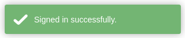
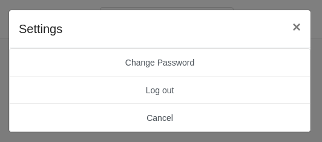
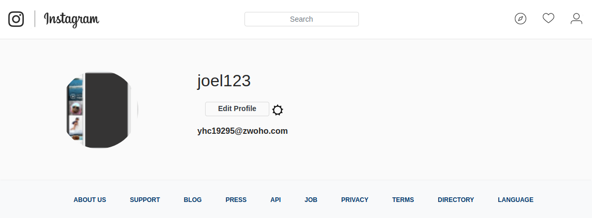
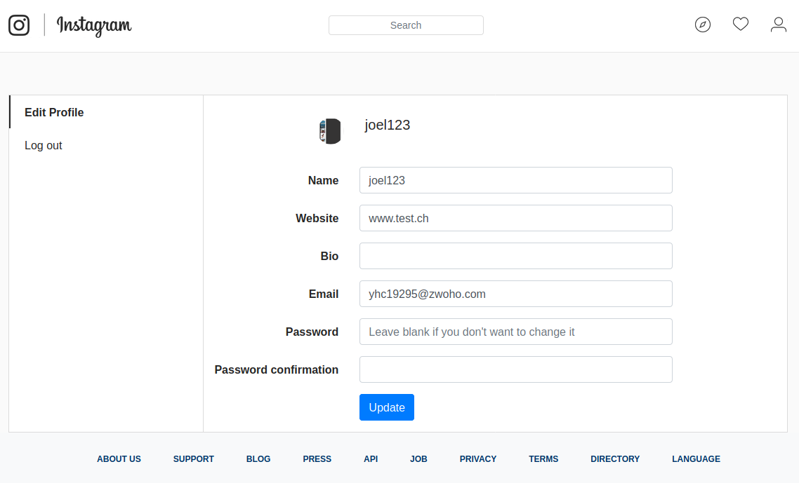
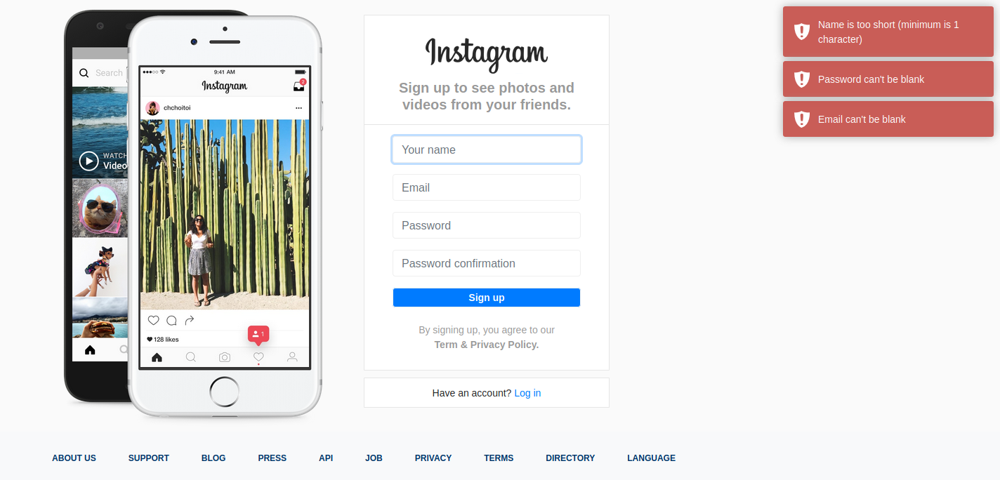

# Quicknotes AB-04 und AB-05

## Beschreibung der Technologien

### Flash-Meldungen in Rails

Mit Flash in Rails hat man die Möglichkeit temporäre Variablen zu speichern, auf welche von überall in der Applikation zugegriffen werden kann. Normalerweise werden diese Variablen für Meldungen genutzt. Das ist sehr praktisch für das Anzeigen von Meldungen bei Aktionen, welche der Benutzer der Applikation ausführt.  
Eine Flash-Meldung besteht immer aus einem Typen und einem Text. Bei den Type gibt es vier verschiedene Möglichkeiten.

* success
* notice
* alert
* error

Flash-Meldungen können auf drei verschiedene Arten angezeigt werden.

```html
<p class="notice"><%= notice %></p>
<p class="alert"><%= alert %></p>
```

```html
<p class="notice"><%= flash[:notice] %></p>
<p class="alert"><%= flash[:alert] %></p>
```

```html
<p class="notice"><%= flash['notice'] %></p>
<p class="alert"><%= flash['alert'] %></p>
```

Das Gem [Devise](https://github.com/heartcombo/devise) erstellt automatisch verschiedene Flash-Meldungen. Beispielsweise wenn man sich einloggt, wird eine Flash-Meldung mit dem Text "Signed in successfully" erstellt.  
Um selbst eine solche Meldung zu erstellen, kann man wie folgt vorgehen.

```ruby
flash[:notice] = "Saved ..."
```

### JavaScript Toaster-Meldungen inkl. Optionen

Damit man die Meldungen nicht selbst stylen muss, gibt es eine JavaScript Library [Toastr](https://www.npmjs.com/package/toastr). Toastr erstellt die Meldung je nach Typ in der entsprechenden Farbe und lässt sie nach einer kurzen Zeit wieder verschwinden. Es gibt 4 verschiedene Typen.

* Info
* Warning
* Success
* Error

So sieht eine Success Toastr Meldung aus.



Toastr wird mit yarn installiert. Die Dokumentation dazu findet man auf der [Website](https://www.npmjs.com/package/toastr).  
Eine neue Toastr Meldung kann nach folgendem Muster erstellt werden.

```js
toastr.success('Nachricht');
```

In der Instagram Applikation wird Toastr verwendet, um die Flash Meldungen anzuzeigen. Im folgenden Code wird durch die Flash Meldungen iteriert und je nach Typ der Flash Meldung, eine Toastr Meldung erstellt.

```html
<% if flash.any? %>
	<script type="text/javascript">
		<% flash.each do |key, value| %>
			<% type = key.to_s.gsub('alert', 'error').gsub('notice', 'success') %>
			toastr.<%= type %>('<%= value %>')
		<% end %>
	</script>
<% end %>
```

### Unterschied Flash-Meldungen und Meldungen des Models

Vom Model werden Meldung ausgelöst, wenn eine Validierung fehlschlägt. Beispielsweise, wenn man sich bei der Instagram Appliaktion registrieren will und nicht alle Felder ausfüllt. Auf die Meldungen des Modals kann über `resource.errors.full_messages` zugegriffen werden.

```html
<% if resource.errors.any? %>
  <script type="text/javascript">
      <% resource.errors.full_messages.each do | value | %>
        toastr.error('<%= value %>')
      <% end %>
  </script>
<% end %>
```

**Unterschied**

Mit den Flash Meldungen hat man grundsätzlich mehr Möglichkeiten, als mit dem Model Meldungen. Model Meldungen können nur gelesen werden und selbst keine erstellt werden. Bei den Model Meldungen gibt es auch nur `Error` Meldungen und keine anderen Typen, wie bei den Flash Meldungen. Im Gegensatz zu den Model Meldungen, kann man Flash Meldungen auch selbst erstellen. Zusätzlich kann man auch noch einen Typ festlegen, um die Meldungen zu kategorisieren.

### Bootstrap Modal

In den [Quicknotes AB-02 und AB-03](Quicknotes_AB_02_03.md) wurde Bootstrap bereits schon erklärt. Hier geht es nun nur noch um die Modal-Komponente von Bootstrap. Mit dem Modal von Bootstrap können schöne Lightboxes, Notifications oder Dialogboxen erstellt werden. Unten sieht man ein Bild eines Modals, welches in der Instagram Applikation implementiert wurde.



Als erstes braucht es einen Button mit dem `data-toggle` `modal` und dem Attribut `data-target` welches auf die ID des Modals verweist. In Beispiel ist die ID des Modals `exampleModal`. Dieser Button öffnet später das Modal.

```html
<button type="button" data-toggle="modal" data-target="#exampleModal"></button>
```

Nun folgt der Code des Modals selbst. Um festzulegen, dass es sich um ein Modal handelt, wird die Klasse `modal` zugewiesen. Als zweites braucht das Modal eine ID, welche frei gewählt werden kann, in diesem Beispiel `exampleModal`. Die ID wird, wie schon erwähnt für den Trigger Button verwendet. Die `role` muss auch noch auf `dialog` gesetzt werden. Innerhalb folgt dann ein weiteres `div` Element mit der Klasse `modal-dialog` und der Rolle `document`. Darin folgt dann der eigentliche Inhalt des Modals mit der Klasse `modal-content`.

```html
<!-- Modal -->
<div class="modal fade" id="exampleModal" tabindex="-1" role="dialog" aria-labelledby="exampleModalLabel" aria-hidden="true"> 
	<div class="modal-dialog" role="document"> 
		<!-- Modal Content -->
		<div class="modal-content"> 
			<!-- Modal Header -->
			<div class="modal-header"> 
				<h5 class="modal-title" id="exampleModalLabel">Settings</h5> 
				<button type="button" class="close" data-dismiss="modal" aria-label="Close"> 
					<span aria-hidden="true">&times;</span> 
				</button> 
			</div> 
			<!-- Modal Body -->
			<div class="list-group text-center"> 
				<a href="#" class="list-group-item list-group-item-action"> Change Password</a> 
				<%= link_to "Log out", destroy_user_session_path, method: :delete, class: "list-group-item list-group-item-action" %> 
				<a href="#" class="list-group-item list-group-item-action" data-dismiss="modal">Cancel</a> 
			</div> 
		</div> 
	</div> 
</div> 
```

### Gravatar für Benutzerbilder

[Gravatar](https://de.gravatar.com/) ist ein Onlinedienst, welcher Email-Adressen mit Profilbildern assoziiert. Man kann sich bei Gravatar mit seiner Email-Adresse registrieren und ein Profilbild hinzufügen. Anhand der Email-Adresse kann dann das entsprechende Profilbild von Gravatar gehohlt werden.

Damit das Profilbild des eingeloggten Users in der Instagram Applikation gehohlt werden kann, muss im [ApplicationHelper](../app/helpers/application_helper.rb) eine Methode geschrieben werden. Diese Methode erstellt aus der Email die Gravatar ID und öffnet dann mithilfe der ID das richtigen Link zum Bild.

```ruby
module ApplicationHelper
	def avatar_url user
		gravatar_id = Digest::MD5::hexdigest(user.email).downcase
		"https://www.gravatar.com/avatar/#{gravatar_id}.jpg"
	end    
end
```

Diese Methode wird anschliessend in der View genutzt, um das Bild anzuzeigen. Als Parameter für die Methode muss noch der User mitgegeben werden.

```erb
<%= image_tag avatar_url(@user), width: '152', height: '152', class: "round-img" %> 
```

### Bilder Hochladen mit CarrierWave

[CarrierWave](https://github.com/carrierwaveuploader/carrierwave) ist eine sehr beliebte Möglichkeit, um in Rails Bilder hochzuladen.  
CarrierWave wird wie die anderen Gems installiert. Im [Gemfile](../Gemfile) muss das Gem hinzugefügt werden und anschliessend mit `bundle install` installiert werden.

```ruby
gem 'carrierwave'
```

Nach der Installation kann ein Uploader erstellt werden.

```sh
rails generate uploader Photo
```

Der erstellte Uploader wird dann genutzt, um die Bilder auf Cloudinary zu speichern, was direkt im nächsten Abschnitt behandelt wird.

### Bilder mit Cloudinary in der Cloud speichern

[Cloudinary](https://cloudinary.com/) stellt einem eine Cloud-basierte Lösung zum Speichern von Bildern und Videos zur Verfügung. Mit einem Gratiskonto stehen einem 25 GB an Speicher zu Verfügung.

Auch Cloudinary muss  wieder als Gem installiert werden.

```ruby
gem 'cloudinary'
```

Damit auf die Cloudinary Cloud zugegriffen werden kann, braucht es noch einen Initializer. Dazu wird die Datei [config/initializers/cloudinary.rb](../config/initializers/cloudinary.rb) erstellt und darin folgender Code geschrieben. Den Namen der Cloud, den API Key und das API Secret erhält man, wenn man sich auf der Seite von [Cloudinary](https://cloudinary.com/) registriert.

```ruby
Cloudinary.config do |config|
	config.cloud_name = "Name der Cloud"
	config.api_key = "API Key"
	config.api_secret = "API Secret"
	config.secure = true
	config.cdn_subdomain = true
end
```

Als nächstes muss dann der Uploader ([app/uploaders/photo_uploader.rb](../app/uploaders/photo_uploader.rb)) konfiguriert werden, welcher mit CarrierWave erstellt wurde. Der Code kann so ziemlich von der [Dokumentation](https://cloudinary.com/documentation/rails_carrierwave#content) übernommen werden.  
Die wichtigsten Konfigurationen sind, dass die Bilder als `jpg` Datei gespeichert werden und die Grösse auf `300px` angepasst wird.

```ruby
include Cloudinary::CarrierWave

process :convert => 'jpg'
process :tags => ['post_picture']

version :standard do
	process :resize_to_fill => [300, 300, :center]
end

version :thumbnail do
	resize_to_fit(100, 100)
end
```

Anschliessend muss der Uploader noch im Model des Photos hinzugefügt werden.

```ruby
class Photo < ApplicationRecord
	belongs_to :post

	mount_uploader :image, PhotoUploader
end
```

Cloudbasierte Lösungen sind für Entwickler sehr praktisch, da man sich nich selbst gross um das Speichern der Bilder oder Videos kümmern muss. Ein Nachteil ist jedoch auch, dass man die Bilder bei einem externen Anbieter specihert, und sommit nicht wirklich volle Kontrolle über die Bilder hat.

### Mit Figaro sensitive Informationen verstecken

Wenn man in seinem Code sensitive Daten hat, sollte man auf jeden Fall vermeiden, dass diese Daten auf ein Git-Server hochgeladen werden.  
Mit [Figaro](https://github.com/laserlemon/figaro) können sensitive Daten in sogenannte Umgebungsvariablen gespeichert und im Code referenziert werden. Die Umgebungsvariablen werden in eine `yml` Datei gespeichert, welche nicht auf den Git-Server hochgeladen wird.

Figaro wird wie die anderen Gems installiert. Im [Gemfile](../Gemfile) muss das Gem hinzugefügt werden und anschliessend mit `bundle install` installiert werden.

```ruby
gem 'figaro'
```

Sobald man Figaro installiert hat, kann ein weiterer Befehl ausgeführt werden, um die Datei [config/application.yml](../config/application.yml) zu erstellen. In diese Datei kommen die Umgebungsvariablen hinein.

```sh
bundle exec figaro install
```

In der Instagram Applikation wird Figaro genutzt, um die API Keys für [Cloudinary](https://cloudinary.com/) zu verstecken. Dazu werden die Keys in der Datei [config/application.yml](../config/application.yml) hinterlegt.

```yml
cloudinary_cloud_name: "Name der Cloud"
cloudinary_api_key: "API Key"
cloudinary_api_secret: "API Secret"
```

Die erfassten Umgebungsvariablen können dann beliebig im Code mit `ENV["Variable"]` referenziert werden. In der Instagramm Appliaktion wird dies in der Datei [config/initializers/cloudinary.rb](../config/initializers/cloudinary.rb) gemacht.

```ruby
Cloudinary.config do |config|
	config.cloud_name = ENV["cloudinary_cloud_name"]
	config.api_key = ENV["cloudinary_api_key"]
	config.api_secret = ENV["cloudinary_api_secret"]
	config.secure = true
	config.cdn_subdomain = true
end
```

Der Vorteil von Figaro ist ganz klar, dass sensitive Daten nicht an die Öffentlichkeit gelangen. Der Nachteil ist jedoch, dass man die Umgebungsvariablen jedes Mal wieder hizufügen muss, wenn man das Git-Repository an einem anderen Ort klont.

## Selbsreflexion

In den letzten zwei Arbeitsblättern habe ich wieder viel im Bereich Ruby on Rails dazugelernt. Von den Themen, welche vorgekommen sind, wusste ich noch nichts, ausser die Meldungen vom Model, welche im vorherigen Modul bereits vorgekommen sind. Die Flash Meldungen sind sehr praktisch, gerade in der Kombination mit der Toastr Library. Ich habe selbst schon solche Toast Meldungen genutzt, aber nicht von dieser Library. Hier fand ich die Anwendung aber deutlich einfacher. Das Bootstrap Modal ist auch serh praktisch für schöne Dialogfenster zu erstellen. Es ist interessant zu sehen, wie soche Komponenten mit anderen Libraries umgesetzt werden, denn in der Firma haben wir eine extra Library, spezifisch für unsere Firma, mit welcher ebenfalls solche Komponenten wie bei Bootstrap umgesetzt werden können.  
Gravatar ist eigentlich auch sehr praktisch, da man die Profilbilder der Benutzer nicht bei sich selbst in der Datenbank speichern muss, sondern einfach über die Email-Adresse des Benutzer darauf zugreifen kann.  
Auch das Hochladen und Speichern von Bildern mit CarrierWave und Cloudinary war sehr interessant, da ich selbst noch nie eine solche cloudbasierte Lösung verwendet habe. Ich habe zuvor nur Bilder als `base64` in meiner eigenen Datenbank gespeichert. Es ist so schon viel einfacher, Bilder zu speichern.  
Und zuletzt auch Figaro war für mich neu, da ich noch nie Code mit sensiblen Daten in ein öffentliches Git Repository hochgeladen habe. Ich sehe aber sehr gut den Sinn dahinter. Man möchte logischerweise nicht, dass andere Leute diese sensiblen Daten sehen können.  
Bei den zwei Arbeitsblättern hatte ich jetzt keine Schwierigkeiten. Die Arbeitsblätter haben alle Schritte sehr gut erklärt, so dass es keine Probleme gab.  
Ich finde es auch sehr gut, dass jetzt auch mehr Themen kommen, welche beim vorherigen Modul noch nicht vorkamen und man so viel mehr Neues dazulernt und nicht nur Altes repetiert.  
In der letzten Reflexion habe ich ja erwähnt, dass ich bereits vorher schon mit den Quicknotes anfangen könnte. Dies konnte ich Teilweise umsetzten, da ich mir während der Arbeitsblätter schon wenige Notizen gemacht habe. Ich habe jedoch noch nicht direkt mit den Quicknotes früher angefangen. Ich denke, dass ich für die nächsten Arbeitsblätter genau gleich vorgehen werde.

## Abschliessende Reflexion

Toast Meldungen sind sehr praktisch und können auch ausserhalb von Ruby on Rails in anderen Technologien verwendet werden. Solche Meldungen benutzte ich selbst in anderen Projekten bereits. Auch das Anwenden von CarrierWave und Cloudinary war sicherlich sehr hilfreich, da solche Clouds wie Cloudinary auch mit anderen Technologien genutzt werden können. Ich benutzte Ruby on Rails ausserhalb dieses Modules nicht, denke aber dass dieses Modul trotzdem sehr hilfreich ist, gerade weil auch solche allgemeine Themen, wie beispielsweise Toast Meldungen und das Speichern von Bildern in Clouds, behandelt werden. In bim mir sicher, dass ich dieses Wissen bei zukünftigen Arbeiten anwenden können werde.

## Aktueller Stand der Applikation





