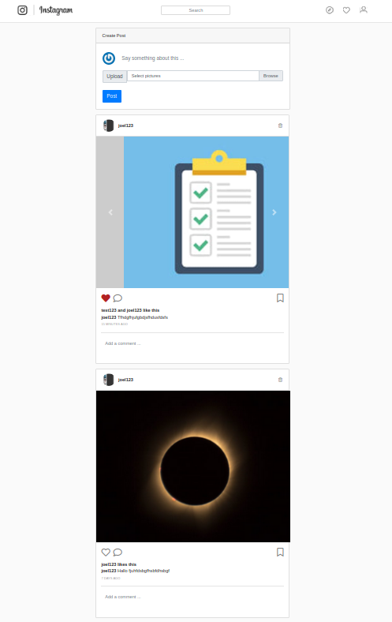
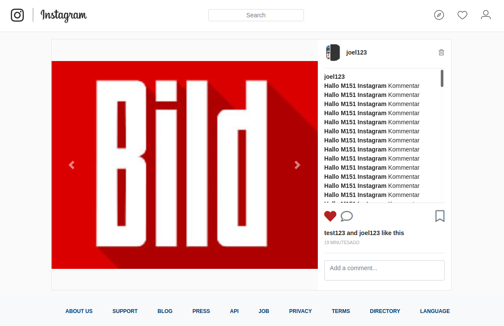
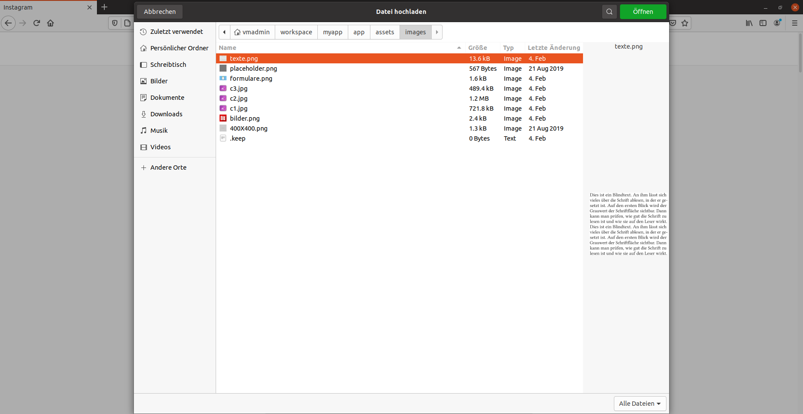

# Quicknotes AB-06 und AB-07

## Beschreibung der Technologien

### Icons von Font Awesome

Mit Font Awesome kann man sehr einfach Icons auf seiner Website einbinden. Ein grosser Vorteil von Font Awesome ist, dass für die Icons Vektorgrafiken verwendet werden, was bedeutet, dass die Icons eine sehr gute Auflösung haben. Sobald man Font Awesome installiert hat, kann mna die Icons wie bei Bootstrap mit Hilfe von CSS Klassen einbinden. EIn NAchteil kann sein, dass es vielleicht ein Icon nicht gibt, welches man gerne benutzen würde.

**Beispiel**

Im folgenden Code Beispiel wird ein Herz Icon als Link eingebunden.  
Die Klasse `fas` legt fest, dass das Icon ausgefüllt sein soll. Die Klasse `fa-heart` bestimmt, dass dies ein Herz Icon sein soll und die Klasse `icon-red` setzt die Farbe des Icons zu rot.

```html
<a href="#" class="fas fa-heart icon-red"></a>
```

### Icons von Font Awesome vs Core-Sprite

Der erste Vorteil der Icons von Font Awesome gegenüber von Core-Sprites ist, dass viel weniger Code geschrieben werden muss und man nicht für jedes Bild noch die Koordinaten herausfinden muss. Ein Vorteil von Core-Sprites ist hingegen, dass man nur eine Datei laden muss. Dies ist ressourcensparender.

**Meine Wahl**

Ich habe mich für die Icons von Font Awesome entschieden, da diese viel einfacher zum einbinden sind, und man nicht noch die Koordinaten herausfinden muss. Da die Instagram Applikation auch nicht so gross ist, muss man hier meiner Meinung nach auch nicht schon an das SParen von Ressourcen denken.

### Lösung für Likes aufführen

Für die Anzeige welche anzeigt, welche und wieviele Personen ein Bild geliked haben, habe ich mich für die If-Else Struktur entschieden. Je nach ANzhal der Likes, wird der entsprechende Text angezeigt.

Wenn die Anzahl der Likes `1` beträgt, wird der Text `<Benutzername 1> likes this` angezeigt.  
Bei der Länge `2` wird der Text `<Benutzername 1> and <Benutzername 2> like this` angezeigt.  
Sobald die Anzahl der Likes `3` beträgt ist der Text `<Benutzername 1>, <Benutzername 2> and <Benutzername 3> like this`.  
Wenn dann die Länge `4` oder mehr ist, werden nur noch die Benutzernamen der letzten zwei Benutzer angezeigt, welche das Bild geliked haben. Der Text lautet dann `<Benutzername 1>, <Benutzername 2> and <Anzahl Likes - 2> others like this`.

```erb
<% if likes.size == 1 %>
  <%= likes[0].user.name + " likes this" %>
<% elsif likes.size == 2 %>
  <%= likes[0].user.name + " and " + likes[1].user.name + " like this" %>
<% elsif likes.size == 3 %>
  <%= likes[0].user.name + ", " + likes[1].user.name + " and " + likes[2].user.name + " like this" %>
<% elsif likes.size >= 4 %>
  <%= likes.second_to_last.user.name + ", " + likes.last.user.name + " and " + likes.size - 2 + " others like this" %>
<% end %>
```

### AJAX

AJAX (Asynchronous JavaScript and XML) beschreibt ein Konzept für die asynchrone Datenübertragung zwischen einem Client und und einem Server. Dieses Konzept bietet die Möglichkeit HTTP-Anfragen zu senden und die Seite zu verändern, ohne die Seite komplett neu zu laden.  
Dies ist ein klarer Vorteil, dass die Seite nicht neu geladen werden muss. Somit werden auch die allgemeinen Ladezeiten verkürzt. AJAX wird voraallem bei Single-Page-Applikationen verwendet, da bei solchen Applikationen diue Seite garnie neu geladen wird. Für den Benutzer ist die Viel angenehmer, als wenn isch immer die ganze Seite neu geladen werden muss. Hingegen wenn eine Seite durch eine Aktion soweiseo neu geladen wird, macht der EInsatz von AJAX nicht wirklich Sinn.

Bei der Instagram Applikation wurde AJAX bei der Like Funktion verwendet. Denn wenn ein Benutzer ein Bild liked, soll nicht die ganze Seite neu geladen werden. Nur die Like Anzeige soll angepasst werden.

## Selbstreflexion

Die Themen der Arbeitsblätter 6 & 7 waren alle für mich nicht wirklich neu. In meinem Betrieb nutzen wir auch Icons wie bei FOnt Awesome, jedoch von einer internen Library. Auch das AJAX Konzept war mir schon bekannt, da ich in meinem Betrieb nur an Single-Page-Applikationen arbeite, bei welchen die Seite nie neu geladen wird. Beim Lernen habe ich immer die Aufträge aufmerksam durchgelesen und achliessend den Code dazu geschrieben. Ich hatte nie grosse Schwierigkeiten, ausser JQuery hat kurz bei mir nicht funktioniert. Durch die Hilfe von Google habe ich dann herausgefunden, dass mein Pfad, welcher auf JQuery verweiste, nicht richtig war. Sobald ich den Pfad angepasst hatte, funktionierte wieder alles. Sommit konnte ich alle obligatorischen Aufgaben der Arbeitsblätter lösen. Die Zusatzaufgaben habe ich mir aus zeitlichen Gründen nicht angeschaut. Bei mir hat das Arbeiten sehr gut funktioniert und ich wüsste im Moment nicht, was ich noch besser machen könnte.

## Abschliessende Reflexion über die Rails-Applikation

**Was waren die wichtigsten neuen Technologien für mich? Was habe ich gelernt?**

Das wichtgeste, was ich gelernt habe ist auf jeden Fall die Anwendung des Ruby on Rails Frameworks. Das Entwurfsmuster MVC, und andere Themen, welche in diesem Modul behandelt worden sind, waren mir beireits schon bekannt. Ich fand es aber trotzdem gut, diese Technologien auch einmal mit einem anderen Framework umzusetzten. So bekam man auch einmal einen Einblick in Technologien, welche man im Alltag bei der Arbeit nicht benötigt.

**Wie bin ich vorgegangen beim Lernen bzw. Ausführen der Aufträge?**

Mit den Arbeitblättern bin ich immer sehr zügig vorangekommen und musste an meiner Applikation nie zu Hause arbeiten. Ich habe die Aufträge immer gut durchgelesen und anschliessend umgesetzt. Wenn ich nicht weitergekommen bin habe ich mir Hilfe im Internet, von Kollegen oder der Lehrpserson geholt. Die Quicknotes hingegen habe ich vorallem zu Hause geschrieben. Sommit habe ich in der Schule vorallem an den Arbeitsblättern gearbeitet und zu Hause an den Quicknotes.

**Was waren generell die Schwierigkeiten, wie konnte ich diese lösen?**

Ich hatte nie grosse Schwierigkeiten und wenn ich welche hatte, konnte ich diese in kurzer Zeit lösen. Wenn ich gerade bicht weiterkam habe ich im Internet nach einer Lösung gesucht, einen Kollegen oder die Lehrperson um Hilfe gebittet. Das Grösste Problem war eigentlich die Zeit. Mit der Applikation bin ich in der Schule zwar gut vorangekommen, jedoch für die Quicknotes musste ich auch noch viel zu Hause arbeiten.

**Funktioniert die Applikation in allen Bereichen wie gefordert?**

Die Instagram Applikation funktioniert in allen Bereichen, so wie es in den Arbeitsblättern gefordert wurde. Einzig die Zusatzanforderungen wurden nicht umgesetzt.

**Bin ich in gewissen Bereichen von der Vorgabe abgewichen?**

Ich bin während der ganzen Instagram Applikation nie von den Vorgaben abgewichen. Ich hätte nirgends den Sinn darin gesehen, warum man hätte von den Vorgaben abweichen sollen. Gerade bei Vorgaben des Designs bin ich sehr daran gewohnt nach VOrgane zu arbeiten. Denn in meinem Betrieb arbeiten wird auch genau nach den Design Vrogaben, welche wir von unseren Designern erhalten.

**Was mache ich bei der nächsten Rails-Applikation bzw. Web-Applikation besser oder anders?**

Das nächste Mal würde ich definitiv von Anfang an die Partial Views einzetzen, wo es Sinn macht. Dies erspart einem am Ende eine grossen Aufwand. Es ist viel praktischer den Code von Anfang an in Partial Views auszulagern, als später den Code mühsam zusammenzusuchen und dann auszulagern. Durch die Partial Views hat man auch einen besseren Überblick über die einzelenen Dateien, da diese so weniger beinhalten, wenn der Code mehr aufgeteilt ist.

## Screenshots der Applikation




