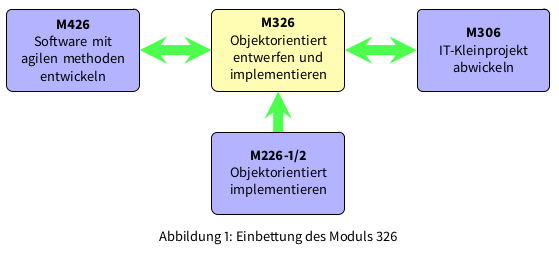
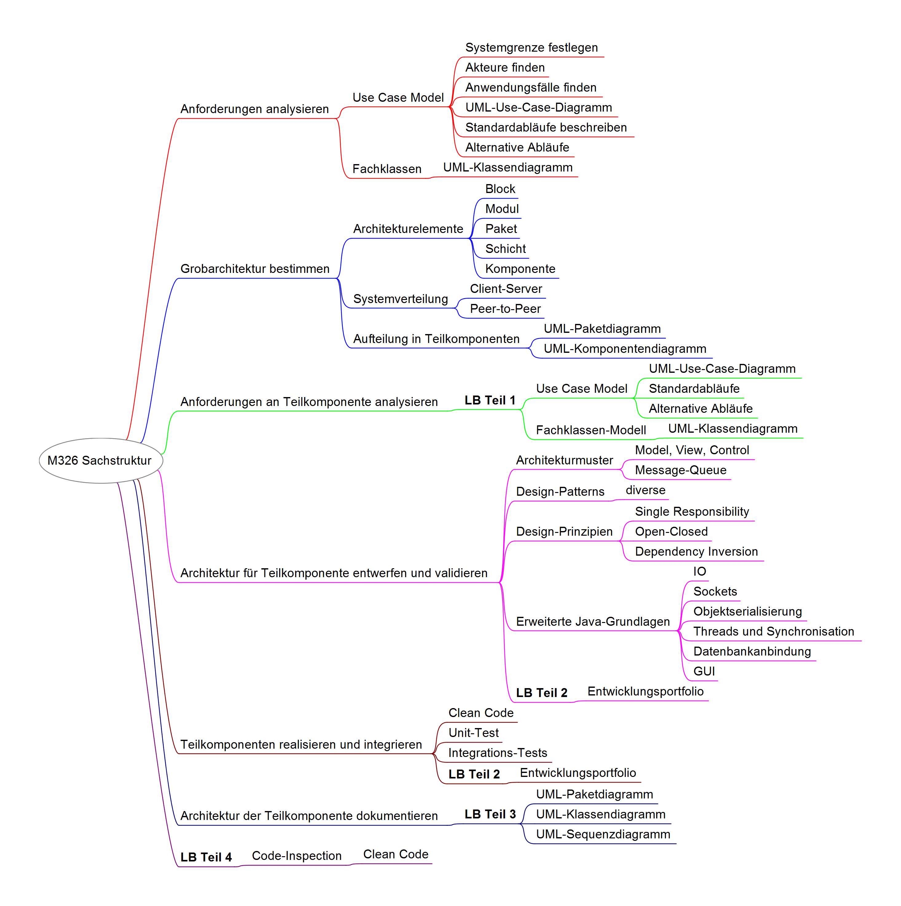

# M326 Leitfaden, Objektorientiert entwerfen und implementieren

## Einleitung
Die Entwicklung eines Softwaresystems, welches nicht nur die gestellten funktionalen Anforderungen erfüllt, sondern auch den Qualitätsansprüchen moderner Softwareentwicklung genügt setzt eine hohe Kompetenz im Software-Engineering voraus. Ein zentraler Begriff in  diesem Zusammenhang ist die Systemarchitektur. Diese muss relativ früh definiert werden. Dabei besteht aber das Risiko, zu einem späteren Zeitpunkt feststellen zu müssen, dass eine unpassende Architektur  gewählt wurde. Mit wachsender Erfahrung kann dieses Risiko reduziert werden.

In diesem Modul wird der Weg von den Anforderungen, bis hin zu einem lauffähigen System, am Beispiel des bekannten Computerspiels Bomberman praktisch zurückgelegt. Ziel ist mit der Klasse eine netzwerkfähige Version des Spiels zu erstellen. Dabei werden Teams gebildet, welche je eine Teilkomponente des Spiels realisieren.  Bei erfolgreicher Umsetzung wird am Schluss ein Turnier in der Klasse durchgeführt.

## Zielsetzung
Die Modulidentifikation [Modulidentifikation](../blob/master/LICENSE) definiert folgende Handlungsziele:

1. Aufgrund der Businessanalyse Anwendungsfälle formulieren und daraus die fachlichen Klassen ableiten.
2. Ein objektorientiertes Design erstellen und mittels Unified Modeling Language darstellen.
3. Objektorientiertes Design implementieren.
4. Erfüllung der fachlichen Anforderung prüfen.
5. Applikations-Architektur nachvollziehbar dokumentieren.

## Einbettung des Moduls
Das folgende Diagramm zeigt die Einbettung des Moduls.

* Das Modul 326 schliesst direkt an die Module 226-1 und 226-2 an. Es kommen wiederum die Programmiersprache Java und die bereits bekannten Werkzeuge für die Entwicklung zum Einsatz. Die erlernten Techniken der objektorientierten Programmierung werden erneut geübt und vertieft.
* Im Modul 426 werden die Techniken der agilen Softwareentwicklung erlernt. Begriffe, wie iterative Entwicklung, Design-Patterns, Clean Code werden in beiden Modulen thematisiert.
* Im Modul 306 wird ein Kleinprojekt realisiert. Dabei liegt der Schwerpunkt auf der Methodik zur Projektabwicklung (Hermes 5). Lernende der Fachrichtung Applikationsentwicklung werden in der Regel ein Softwareentwicklungsprojekt durchführen. Während der Konzeptphase müssen hierzu die Anforderungen erfasst und eine Architektur für die Lösung entworfen werden. Je nach Projekt werden auch bereits erste Anforderungen umgesetzt. Im Modul 326 werden die nötigen Kompetenzen für diese Arbeit erlernt.

# Inhalte

Das folgende Mindmap zeigt die Sachstruktur  des Moduls und die Einbettung der vier Teile der Leistungsbewertung (LB).

# Didaktische Grundsätze und Organisation des Unterrichts

* Um das Thema Software-Architektur sinnvoll zu bearbeiten, sollte eine etwas grössere Anwendung  betrachtet werden. Grösser heisst hier mehr als drei bis fünf Fachklassen. Eine solche Anwendung würde aber die Möglichkeiten eines einzelnen Lernenden schnell übersteigen. Auf der anderen Seite steht mit einer ganzen Klasse eine beträchtliche Manpower zur Verfügung. Deshalb verfolgt dieses Modul den Ansatz, eine grössere Applikation in Teilkomponenten aufzuteilen und jede Komponente durch ein Zweier- bis Dreierteam entwickeln zu lassen.

* Dieser Ansatz hat verschiedene Vorteile. Alle Lernenden sind gefordert. Nicht alle arbeiten an den genau gleichen Werkstücken. Eine funktionierende Gesamtanwendung kann nur dann erreicht werden, wenn alle Teilkomponenten funktionieren und zusammenpassen. Dieser Umstand soll als Motivator für die Lernenden genutzt werden. Zusätzlich sinkt die Gefahr von reinen Kopien, ohne nennenswerte Eigenleistung eines Lernenden.

* Um die Chance auf Erfolg zu erhöhen, sollen die zentralen Komponenten in zwei Varianten durch je ein eigenes Team entwickelt werden. Bei der Zuteilung der Komponenten soll auf die Leistungsfähigkeit und auf die fachlichen Interessen der Teams geachtet werden. Die Komponenten haben einen unterschiedlichen Schwierigkeitsgrad.

* Die praktische Arbeit steht im Zentrum. Die fachlichen Grundlagen erarbeiten sich die Lernenden selbständig und nutzen dabei das Fachbuch \cite{abts2016grundkurs}, sowie die Ressourcen, welche mit den Modulunterlagen zur Verfügung gestellt werden. Diese Ressourcen beinhalten neben Textdokumenten, Web-Links und Screenshots auch Screencasts. Letztere können die Lernenden im Unterricht selbständig konsultieren. Damit niemand gestört wird, sollen sie dazu ihre eigenen Kopfhörer verwenden.

* Ergänzend soll die Lehrperson mit den Teams, welche an den gleichen Komponenten arbeiten Workshops durchführen. In diesen Workshops können spezifische Fragen zu den Komponenten bearbeitet werden.

* Die Aufteilung in Teilkomponenten bringt mit sich, dass die Lernenden nicht genau die gleichen fachlichen Themen bearbeiten werden. Beispielsweise hat die Client-Seite ein GUI, während auf der Serverseite kein solches vorhanden ist. Dafür muss dort auf die Synchronisation von Threads geachtet werden. Aus diesem Grund werden in den Unterlagen immer wieder die fundamentalen Ideen, welche allgemeine Bedeutung haben (z.B. die Umkehrung von Abhängigkeiten), ins Zentrum gestellt. Diese fundamentalen Ideen stehen auch bei der Leistungsbewertung im Zentrum.

* Die Aufteilung  in Teilkomponenten bedingt auch klar definierte Schnittstellen zwischen diesen Komponenten. Diese Schnittstellen werden in den Unterlagen vorgegeben. Zusätzlich werden Unit-Tests erstellt, gegen welche die Implementation einer Schnittstelle getestet werden kann. Dadurch soll eine unabhängige Entwicklung  der Komponenten ermöglicht werden.

* Die Leistungsbeurteilung erfolgt nach der Vorgabe in \cite{Leistungsbeurteilungsvorgabe}. Allerdings wird die dort beschriebene Konzentration auf das Fachgespräch am Schluss des Moduls aufgebrochen, indem schon während dem Semester einzelne Bestandteile der Leistungsbewertung abgegeben und bewertet werden. Dadurch soll eine zu starke Arbeitslast am Ende des Semesters verhindert werden. Die Bewertungskriterien sind im Dokument \href{../06_LBV/BR326_Bewertungsraster.pdf}{BR326 Bewertungsraster.pdf} beschrieben.

## Lernumgebung
Als Lernumgebung kommt die [smartlearn.ch SSD](https://smartlearn.ch)-Maschine bmWP1 (Windows 7) oder bmWP2 (Windows 10) zum Einsatz. Darauf sind die Entwicklungsumgebung [Eclipse](\href{https://www.eclipse.org/), sowie das UML-Tool [Modelio](\href{https://www.modelio.org/) installiert.

### [smartlearn.ch SSD](\href{https://smartlearn.ch)
Die Lernenden arbeiten mit Ihrer persönlichen [smartlearn.ch SSD](https://smartlearn.ch) und haben während des ganzen Unterrichts eine Mitbringpflicht. Sollten Sie die [smartlearn.ch SSD](https://smartlearn.ch) nicht dabei haben, sind Sie selber verantwortlich, die verpassten Arbeiten nachzuholen. Anwesenheit im Unterricht des Moduls 326 ohne [smartlearn.ch SSD](https://smartlearn.ch) ist nicht zielführend und ineffektiv.

## Unterrichtsmaterial

### Lernende:

* Lernumgebung [smartlearn.ch SSD](https://smartlearn.ch)
* bmWP1 oder bmWP2 mit [Eclipse](\href{https://www.eclipse.org/) und [Modelio](\href{https://www.modelio.org/)
* Grundkurs JAVA, \fullcite{abts2016grundkurs}
* Arbeitsblätter und Ressourcen

## Lehrpersonen:
Es empfiehlt sich, ein aktuelles Buch zur UML 2.x anzuschaffen. Zwei bewährte Bücher sind:

* Bernd Oestereich, Axel Scheithauer: Analyse und Design mit der UML, Oldenbourg Wissenschaftsverlag
* Chris Rupp, et. al.: UML 2 glasklar, Hanser Fachbuch

Zur Vertiefung des „objektorientierten Handwerks“ mit Java wird folgendes Buch empfohlen:

* Robert C. Martin, Clean Code: A Handbook of Agile Software Craftsmanship, Prentice Hall

## Ordnerstruktur
Ordnerstruktur für Modul 326 auf dem iet-gibb-Modulserver (Laufwerk M):	

Die Mindmaps sind mit dem Tool [Freeplane](http://www.freeplane.org) erstellt. Das Tool steht als portable App auf der [smartlearn.ch SSD](https://smartlearn.ch) zur Verfügung. Es wird ausdrücklich empfohlen mit diesem Tool zu arbeiten und nicht mit Freemind, da letzteres die Mindmaps nicht richtig darstellt.

## Hinweise zum Selbststudium
Die Modulunterlagen sind für den Präsenzunterricht geeignet. Ein Selbststudium ist möglich. Allerdings muss mit der Betreuungsperson vereinbart werden, wie die Aufteilung der Teilkomponenten auf verschiedene Teams im Einzelfall gehandhabt wird.
Unabhängig davon ist es zwingend erforderlich, die Unterlagen in der im Modulplan (siehe Semesterplan) angegebenen Reihenfolge abzuarbeiten. Die referenzierten Dokumente sind dabei unbedingt zu konsultieren, da dort die benötigten Grundlagenkenntnisse vermittelt werden. Musterlösungen zu den einzelnen Aufgaben erhalten Sie von Ihrer Betreuungsperson.

# Semesterplan (generalisiert)

(ohne Gewähr, für den Verbindlichen Semesterplan konsultieren Sie bitte [ML326.pdf](02_Modulleitfaden/ML326.pdf))

| Unterricht | Inhalt | Handlungsziel |
|---         |---     |---            |
| 1 | Einführung, Modulziele, Inhalt und Ablauf, Anforderungen an Applikation und Tools kennenlernen | 1|
|   |  | |
|2,3 | Anforderungen an Gesamtsystem analysieren Anwendungsfälle, Fachklassen finden und beschreiben | 1 |
|    |     | |
|3,4 | Grobarchitektur für Gesamtsystem | 2 |
|    | • Elemente für die Beschreibung der Architektur (Pakete, Module, Komponenten, Schichten, Schnittstellen), Architekturmuster kennenlernen| |
|    | • Festlegung der Aufteilung in Teilkomponenten und Zuweisung an Entwicklerteams | |
|    |     | |
|5,6 | Anforderungen an Teilkomponente analysieren | 1 |
|    | LB Teil 1: Anwendungsfälle und Fachklassen für Teilkomponente | |
|    |     | |
|    | Herbstferien                                                  | |
|7,8,9,10,11| Architektur der Teilkomponente entwerfen und validieren|2,3,4 |
|    |• Java-Grundlagen (Threads, Sockets, IO, Objekt-Serialisierung, JDBC / JPA)| |
|    |• Architekturmuster, SW-Design-Prinzipien, Design-Patterns | |
|    |• Implementation der architekturrelevanten Anwendungsfälle | |
|    |• Komponententest und erste Integration                    | |
|    |     | |
|12,13,14,15,16| Teilkomponenten fertigstellen und System integrieren |2,3,4|
|     |* SW-Design-Prinzipien, Design-Patterns , SW-Qualität, Clean Code | |
|     |* Restliche Anwendungsfälle implementieren und testen | |
|     |* Integration und Systemtest                          | |
|    |     | |
|    | Weihnachtsferien                                      | |
|    |     | |
|17,18|Architektur dokumentieren, Code-Inspektionen |4,5|
|    |LB, Teil 3: Strukturelle und dynamische Beschreibung der gewählten Architektur mit UML-Diagrammen     | |
|    |     | |
|19,20|Turnier und Abschluss| 4 |
|    |     | |

